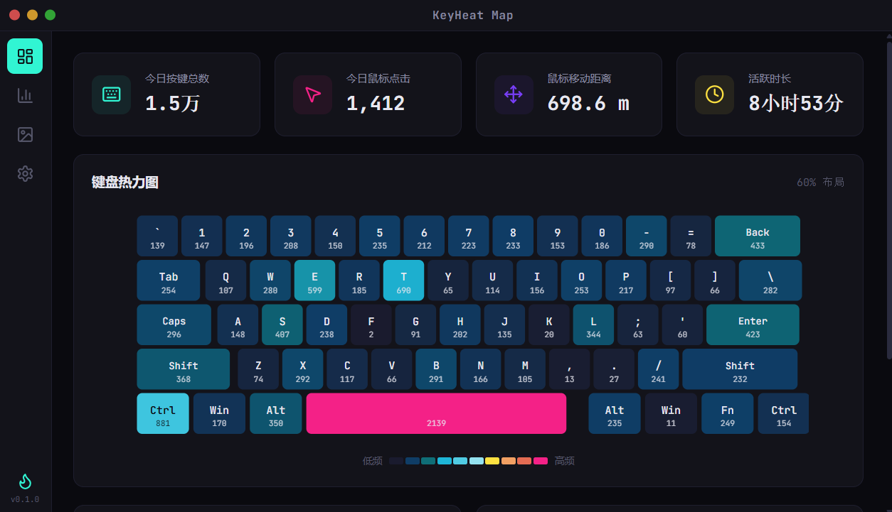

<div align="center">

# 🔥 KeyHeat Map

**跨平台键盘/鼠标热力图桌面应用**

专为程序员和游戏玩家设计，用精美的可视化记录你的每一次按键和鼠标操作。

[](https://github.com/laishouchao/keyheat-map/releases)
[]()
[](LICENSE)
[](https://tauri.app/)

[下载安装](https://github.com/laishouchao/keyheat-map/releases/latest) · [报告问题](https://github.com/laishouchao/keyheat-map/issues)

</div>

---

## 📸 应用截图



> 启动应用后，在后台静默记录键盘和鼠标数据，打开窗口即可查看精美的热力图和数据分析。所有数据仅存储在本地，不会上传到任何服务器。

---

## ✨ 功能特性

### 🎹 键盘热力图
- 实时记录每一次按键，SVG 矢量键盘布局可视化
- **实时按键高亮** — 按下键盘时对应按键实时亮起，带霓虹发光效果
- 多种配色方案（霓虹 / 暖色 / 冷色 / 单色）
- 悬停查看按键详细统计（次数、占比）
- 支持多种键盘布局（60% / 75% / 全尺寸）

### ⌨️ 组合快捷键追踪
- 自动识别 `Ctrl+C`、`Ctrl+V`、`Alt+Tab` 等所有组合键
- 组合快捷键排行榜（TOP 15）
- 按时间范围筛选统计

### 📊 数据分析仪表盘
- 今日 / 本周 / 本月 / 全部时间范围统计
- 按键趋势折线图 + 鼠标点击趋势
- 按键分布饼图（字母区 / 数字区 / 符号区 / 修饰键 / 功能键）
- 24 小时活跃度热力分布（仿 GitHub 贡献图）
- 鼠标移动热力图
- 详细按键排行榜

### 🖼️ 分享海报生成
- **电竞炫酷风** — 深色背景 + 霓虹色彩 + 粒子效果
- **极简数据风** — 白色背景 + 简洁数据卡片
- **GitHub 贡献风** — 仿 GitHub 贡献图样式
- 一键导出 PNG 图片，分享你的键盘数据

### ⚙️ 系统功能
- 系统托盘常驻，后台静默运行
- 开机自启动
- 数据导出（JSON / CSV）
- 数据每 3 秒自动刷新，统计数字平滑过渡动画
- 关闭窗口自动隐藏到托盘

---

## 🛠️ 技术栈

| 层级 | 技术 | 说明 |
|------|------|------|
| 前端 | React 18 + TypeScript + Vite | 现代化前端框架 |
| 后端 | Rust (Tauri v1) | 高性能、低内存占用 |
| 输入监听 | rdev | 全局键盘/鼠标事件钩子 |
| 数据库 | SQLite (rusqlite) | 零配置本地数据存储 |
| 图表 | Recharts | React 数据可视化 |
| 动画 | Framer Motion | 流畅的 UI 动画 |
| 图标 | Lucide React | 精美的图标库 |

> **安装包大小仅 ~7MB**，内存占用 < 30MB，远优于 Electron 方案。

---

## 📦 安装

### 从 Release 下载（推荐）

前往 [Releases](https://github.com/laishouchao/keyheat-map/releases/latest) 页面下载对应平台的安装包：

| 平台 | 文件 | 安装方式 |
|------|------|----------|
| **Windows** | `.msi` / `.exe` | 双击安装 |
| **macOS** | `.dmg` | 拖拽到 Applications |
| **Ubuntu / Debian** | `.deb` | `sudo dpkg -i keyheat-map_*.deb` |
| **Fedora / RHEL** | `.rpm` | `sudo rpm -i keyheat-map-*.rpm` |

### 从源码编译

**前置要求：**
- Node.js >= 18
- Rust >= 1.75
- 平台依赖：
  - **Ubuntu / Debian**: `sudo apt install libwebkit2gtk-4.0-dev libssl-dev libgtk-3-dev libayatana-appindicator3-dev librsvg2-dev`
  - **macOS**: `xcode-select --install`
  - **Windows**: [Microsoft Visual Studio C++ Build Tools](https://visualstudio.microsoft.com/visual-cpp-build-tools/)

```bash
# 克隆仓库
git clone https://github.com/laishouchao/keyheat-map.git
cd keyheat-map

# 安装前端依赖
npm install

# 开发模式（热重载）
npm run tauri dev

# 编译发布版本
npm run tauri build
```

---

## 🖥️ 跨平台支持

| 平台 | 状态 | 格式 |
|------|------|------|
| Windows (x64) | ✅ | MSI / NSIS |
| macOS (Intel) | ✅ | DMG |
| macOS (Apple Silicon) | ✅ | DMG |
| Ubuntu / Debian | ✅ | DEB |
| Fedora / RHEL | ✅ | RPM |

---

## 📁 项目结构

```
keyheat-map/
├── src/                          # 前端 (React + TypeScript)
│   ├── pages/
│   │   ├── Dashboard.tsx         # 🎹 键盘热力图主页
│   │   ├── StatsPage.tsx         # 📊 数据分析仪表盘
│   │   ├── PosterPage.tsx        # 🖼️ 分享海报生成
│   │   └── SettingsPage.tsx      # ⚙️ 设置页面
│   ├── components/               # 公共组件（侧边栏、标题栏）
│   ├── hooks/                    # 自定义 Hooks
│   └── utils/                    # 工具函数（键盘布局、颜色、格式化）
├── src-tauri/src/                # 后端 (Rust)
│   ├── main.rs                   # 主入口 + 窗口配置
│   ├── db.rs                     # SQLite 数据库管理
│   ├── input_listener.rs         # 全局键盘/鼠标钩子 + 组合键检测
│   ├── commands.rs               # Tauri 命令（15 个 API）
│   └── tray.rs                   # 系统托盘
├── .github/workflows/release.yml # CI/CD 自动编译三平台
└── assets/                       # 截图等资源文件
```

---

## 📄 许可证

[MIT License](LICENSE)

---

## 🙏 致谢

- [Tauri](https://tauri.app/) — 跨平台桌面应用框架
- [rdev](https://github.com/Narsil/rdev) — 全局输入事件监听
- [Recharts](https://recharts.org/) — React 数据可视化
- [Framer Motion](https://www.framer.com/motion/) — React 动画库
- [Lucide](https://lucide.dev/) — 精美的图标库
